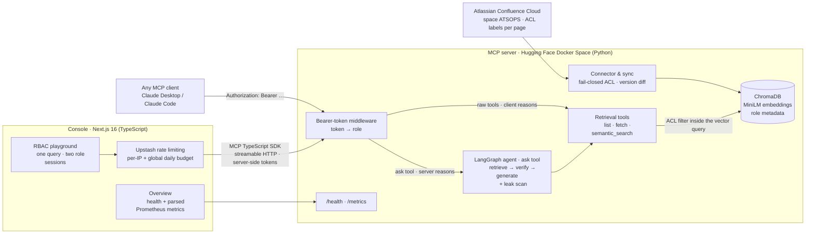

# 🌌 confluence-bot — RBAC-Enforced MCP Documentation RAG, End to End

[](https://hoodieylya13-mcp-confluence-documentation-rag.hf.space/health)
[](https://modelcontextprotocol.io/)
[](https://github.com/HoodieYlya13/mcp-confluence-documentation-rag/blob/main/SECURITY.md)
[](https://www.python.org/)
[](https://nextjs.org/)

A complete, production-deployed **Model Context Protocol** system built around one idea: *the same question must yield different answers depending on who is asking — and nothing else must ever leak.*

It spans the full stack of an applied-AI knowledge system:

- a **Python MCP server** that turns a live Atlassian Confluence instance into an RBAC-enforced RAG substrate, secured by a four-layer enforcement model and gated by an automated evaluation suite — deployed 24/7 on Hugging Face Spaces;
- a **Next.js 16 console** that lets anyone *experience* the access-control story in a browser — live health and metrics, plus a playground that asks one question through two real MCP sessions with different bearer tokens and shows, side by side, what each authorization level is allowed to retrieve.

```
confluence-bot                             ← you are here (umbrella / showcase repo)
├── mcp-confluence-documentation-rag       Python MCP server — secure Confluence connector,
│                                          LlamaIndex + ChromaDB retrieval with ACL pushdown,
│                                          LangGraph agent, eval gates, Prometheus metrics
└── confluence-bot-app                     Next.js 16 console — live health & metrics dashboard,
                                           dual-role RBAC playground over MCP streamable HTTP
```

---

## Try it live

| What | Where |
|---|---|
| **Console** | [`confluence-bot.hy13dev.com`](https://confluence-bot.hy13dev.com) — live dashboard + RBAC playground, no setup required |
| Server health | [`/health`](https://hoodieylya13-mcp-confluence-documentation-rag.hf.space/health) — corpus size, retriever backend, sync status |
| Prometheus metrics | [`/metrics`](https://hoodieylya13-mcp-confluence-documentation-rag.hf.space/metrics) — tool calls, latency, RBAC denials by layer |
| MCP endpoint | `https://hoodieylya13-mcp-confluence-documentation-rag.hf.space/mcp` — requires a bearer token; tokens map to roles **server-side** |

The console's [RBAC playground](https://confluence-bot.hy13dev.com/playground) asks the same accelerator-operations question as `JUNIOR_OP` and as `ATS_CORE_LEAD` simultaneously, and highlights every chunk the document ACL filter withheld from the lower-privileged session — in real time, against the real index. (The free-tier Space sleeps when idle; the console treats "waking up" as a state, not an error.)

```bash
claude mcp add --transport http accelerator-ops \
  https://hoodieylya13-mcp-confluence-documentation-rag.hf.space/mcp \
  --header "Authorization: Bearer <token>"
```

---

## The system in one picture



---

## Half 1 — the MCP server ([`mcp-confluence-documentation-rag`](https://github.com/HoodieYlya13/mcp-confluence-documentation-rag))

A zero-trust RAG pipeline over real Confluence content:

- **Secure connector** — Confluence REST sync with fail-closed ACL mapping (a page with no recognized ACL label is restricted, never public) and incremental version-diff updates.
- **Structure-preserving ingestion** — XHTML → Markdown with scientific tables kept atomic and heading context carried into every sub-chunk.
- **ACL pushdown** — role filters are evaluated *inside* the ChromaDB vector query, so unauthorized chunks never enter the candidate set, no matter what the calling code does.
- **Four-layer enforcement** — bearer auth → ACL pushdown → LangGraph context-verifier node → post-generation leak scanner. A compromised retriever or a prompt injection embedded in the corpus cannot leak restricted content. Full threat model in [SECURITY.md](https://github.com/HoodieYlya13/mcp-confluence-documentation-rag/blob/main/SECURITY.md).
- **Two deployment modes, one server** — capable clients (Claude Desktop / Claude Code) call the raw retrieval tools and do their own reasoning (layers 1–2); thin or untrusted clients call the single `ask` tool, which runs the full LangGraph agent server-side so the verify gate and leak scanner (layers 3–4) are enforced regardless of caller. Identical RBAC either way.
- **Gated evaluation suite** — 8 scenarios run in CI with exit-code gates: golden-set retrieval, adversarial probes (including a permanent prompt-injection fixture *inside the live corpus*), LLM-as-judge faithfulness, and a 0.00% leakage target.
- **MLOps** — two-speed GitHub Actions (seconds-fast offline gates per push, full semantic + LLM pipeline nightly), Trivy scans, self-healing nightly sync, custom Prometheus exposition. Runs at **$0/month**.

Latest live evaluation: **0.00% RBAC leakage · 0 adversarial probes leaked · 100% golden-set hit rate @3 · 100% faithfulness.**

## Half 2 — the console ([`confluence-bot-app`](https://github.com/HoodieYlya13/confluence-bot-app))

A deliberately thin, security-conscious window over the live server — no MCP client required:

- **Overview** — `/health` plus Prometheus exposition parsed server-side into semantic cards: indexed corpus, tool calls, RBAC denials *by enforcement layer*, latency, sync status.
- **RBAC playground** — one query fans out to two genuine MCP sessions (official [MCP TypeScript SDK](https://github.com/modelcontextprotocol/typescript-sdk) over streamable HTTP, full initialize → tool-call → close handshake) holding different bearer tokens; chunks withheld from the junior operator are badged as restricted.
- **Server-first Next.js 16** — Cache Components / Partial Prerendering, React Compiler, server actions, and a `next/form` GET flow: the playground works with JavaScript disabled, and the only client component in the app is a pending-state submit button.
- **No JSON API surface** — tokens are `server-only`, the browser receives rendered HTML, and the single path to the MCP server is guarded by Upstash rate limiting (per-IP sliding window + global daily budget, fail-closed in production).

---

## Run it yourself

```bash
git clone --recurse-submodules https://github.com/HoodieYlya13/confluence-bot.git
```

**Server — fully offline, no accounts needed:**

```bash
cd mcp-confluence-documentation-rag
make build && make test && make run-eval && make run-agent
```

**Console:**

```bash
cd confluence-bot-app
bun install && cp .env.example .env.local && bun dev
```

Each submodule's README has the full quickstart (live Confluence pipeline, Claude Desktop wiring, Vercel deployment).

---

## Documentation map

| Document | What's in it |
|---|---|
| [server README](https://github.com/HoodieYlya13/mcp-confluence-documentation-rag#readme) | Architecture diagram, quickstarts, evaluation report, repository map |
| [server SECURITY.md](https://github.com/HoodieYlya13/mcp-confluence-documentation-rag/blob/main/SECURITY.md) | Identity model, the four enforcement layers, threat model |
| [server TAD.md](https://github.com/HoodieYlya13/mcp-confluence-documentation-rag/blob/main/TAD.md) | Every server design decision with rationale |
| [console README](https://github.com/HoodieYlya13/confluence-bot-app#readme) | Console setup, environment variables, deployment |
| [console TAD.md](https://github.com/HoodieYlya13/confluence-bot-app/blob/main/TAD.md) | Every console design decision with rationale |

House convention across the project: **no code comments or docstrings** — all design rationale lives in each repo's `TAD.md`.
