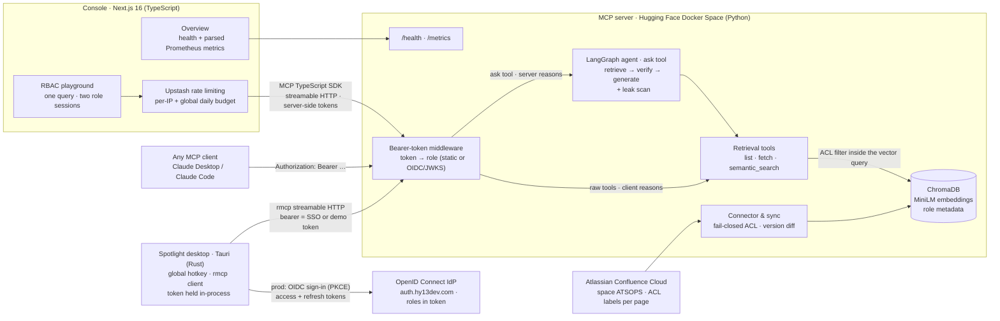

<p align="center">
  
</p>

# 🌌 confluence-bot — RBAC-Enforced MCP Documentation RAG, End to End

[](https://hoodieylya13-mcp-confluence-documentation-rag.hf.space/health)
[](https://modelcontextprotocol.io/)
[](https://github.com/HoodieYlya13/mcp-confluence-documentation-rag/blob/main/SECURITY.md)
[](https://www.python.org/)
[](https://nextjs.org/)
[](https://tauri.app/)

A complete, production-deployed **Model Context Protocol** system built around one idea: _the same question must yield different answers depending on who is asking — and nothing else must ever leak._

It spans the full stack of an applied-AI knowledge system:

- a **Python MCP server** that turns a live Atlassian Confluence instance into an RBAC-enforced RAG substrate, secured by a four-layer enforcement model and gated by an automated evaluation suite — deployed 24/7 on Hugging Face Spaces;
- a **Next.js 16 console** that lets anyone _experience_ the access-control story in a browser — live health and metrics, plus a playground that asks one question through two real MCP sessions with different bearer tokens and shows, side by side, what each authorization level is allowed to retrieve;
- a **Tauri desktop spotlight** (Rust) that summons a frameless command bar on a global hotkey, asks the server's agent in one keystroke, and returns a grounded answer with links straight to the source Confluence pages — the same RBAC-governed server, driven from a third language, with the bearer token held in the trusted process and never exposed to the webview.

```
confluence-bot                             ← you are here (umbrella / showcase repo)
├── mcp-confluence-documentation-rag       Python MCP server — secure Confluence connector,
│                                          LlamaIndex + ChromaDB retrieval with ACL pushdown,
│                                          LangGraph agent, eval gates, Prometheus metrics
├── confluence-bot-app                     Next.js 16 console — live health & metrics dashboard,
│                                          dual-role RBAC playground over MCP streamable HTTP
└── confluence-spotlight                   Tauri desktop spotlight (Rust) — global-hotkey command
                                           bar, real rmcp client, token held server-side
```

<p align="center">
  <video src="https://hy13dev.com/confluence-bot-spotlight.mp4" width="100%" autoplay loop muted playsinline></video>
</p>

---

## Try it live

| What               | Where                                                                                                                               |
| ------------------ | ----------------------------------------------------------------------------------------------------------------------------------- |
| **Console**        | [`confluence-bot.hy13dev.com`](https://confluence-bot.hy13dev.com) — live dashboard + RBAC playground, no setup required            |
| Server health      | [`/health`](https://hoodieylya13-mcp-confluence-documentation-rag.hf.space/health) — corpus size, retriever backend, sync status    |
| Prometheus metrics | [`/metrics`](https://hoodieylya13-mcp-confluence-documentation-rag.hf.space/metrics) — tool calls, latency, RBAC denials by layer   |
| MCP endpoint       | `https://hoodieylya13-mcp-confluence-documentation-rag.hf.space/mcp` — requires a bearer token; tokens map to roles **server-side** |

The console's [RBAC playground](https://confluence-bot.hy13dev.com/playground) asks the same accelerator-operations question as `JUNIOR_OP` and as `ATS_CORE_LEAD` simultaneously, in two modes: **compare retrieval** highlights every chunk the document ACL filter withheld from the lower-privileged session, while **compare answers** runs the server-side LangGraph agent and contrasts the grounded answer each role receives — in real time, against the real index. (The free-tier Space sleeps when idle; the console treats "waking up" as a state, not an error.)

```bash
claude mcp add --transport http accelerator-ops \
  https://hoodieylya13-mcp-confluence-documentation-rag.hf.space/mcp \
  --header "Authorization: Bearer <token>"
```

---

## The system in one picture



---

## Half 1 — the MCP server ([`mcp-confluence-documentation-rag`](https://github.com/HoodieYlya13/mcp-confluence-documentation-rag))

A zero-trust RAG pipeline over real Confluence content:

- **Secure connector** — Confluence REST sync with fail-closed ACL mapping (a page with no recognized ACL label is restricted, never public) and incremental version-diff updates.
- **Structure-preserving ingestion** — XHTML → Markdown with scientific tables kept atomic and heading context carried into every sub-chunk.
- **ACL pushdown** — role filters are evaluated _inside_ the ChromaDB vector query, so unauthorized chunks never enter the candidate set, no matter what the calling code does.
- **Four-layer enforcement** — bearer auth → ACL pushdown → LangGraph context-verifier node → post-generation leak scanner. A compromised retriever or a prompt injection embedded in the corpus cannot leak restricted content. Full threat model in [SECURITY.md](https://github.com/HoodieYlya13/mcp-confluence-documentation-rag/blob/main/SECURITY.md).
- **Two token kinds, one identity model** — the bearer is either a pre-shared role token (the demo path) or an **OIDC access token** from the self-hosted identity provider, verified via JWKS with its `roles` claim mapped to a role; either way the server resolves the role and the client never states its own privilege.
- **Two deployment modes, one server** — capable clients (Claude Desktop / Claude Code) call the raw retrieval tools and do their own reasoning (layers 1–2); thin or untrusted clients call the single `ask` tool, which runs the full LangGraph agent server-side so the verify gate and leak scanner (layers 3–4) are enforced regardless of caller. Identical RBAC either way.
- **Gated evaluation suite** — 8 scenarios run in CI with exit-code gates: golden-set retrieval, adversarial probes (including a permanent prompt-injection fixture _inside the live corpus_), LLM-as-judge faithfulness, and a 0.00% leakage target.
- **MLOps** — two-speed GitHub Actions (seconds-fast offline gates per push, full semantic + LLM pipeline nightly), Trivy scans, self-healing nightly sync, custom Prometheus exposition. Runs at **$0/month**.

Latest live evaluation: **0.00% RBAC leakage · 0 adversarial probes leaked · 100% golden-set hit rate @3 · 100% faithfulness.**

## Half 2 — the console ([`confluence-bot-app`](https://github.com/HoodieYlya13/confluence-bot-app))

A deliberately thin, security-conscious window over the live server — no MCP client required:

- **Overview** — `/health` plus Prometheus exposition parsed server-side into semantic cards: indexed corpus, tool calls, RBAC denials _by enforcement layer_, latency, sync status.
- **RBAC playground** — one query fans out to two genuine MCP sessions (official [MCP TypeScript SDK](https://github.com/modelcontextprotocol/typescript-sdk) over streamable HTTP, full initialize → tool-call → close handshake) holding different bearer tokens, in two modes: **compare retrieval** badges the chunks withheld from the junior operator, while **compare answers** calls the server-side `ask` agent tool and contrasts the grounded answer each role receives.
- **Server-first Next.js 16** — Cache Components / Partial Prerendering, React Compiler, server actions, and a `next/form` GET flow: the playground works with JavaScript disabled, and the only client component in the app is a pending-state submit button.
- **No JSON API surface** — tokens are `server-only`, the browser receives rendered HTML, and the single path to the MCP server is guarded by Upstash rate limiting (per-IP sliding window + global daily budget, fail-closed in production).
- **Demo token issuer for Spotlight** — it also fronts the desktop app's _demo_ sign-in: a PKCE handoff (`/spotlight-login` → `/api/spotlight/token`) that hands a hardcoded role token to a dev build. Production Spotlight bypasses the console and signs in against the identity provider directly.

## Half 3 — the desktop spotlight ([`confluence-spotlight`](https://github.com/HoodieYlya13/confluence-spotlight))

A Tauri v2 desktop client that puts the assistant one keystroke away — and proves the security model holds outside the browser:

- **Summon-on-hotkey UX** — a frameless, always-on-top, centered command bar (Raycast/Spotlight style) bound to a global shortcut (`Cmd+Shift+Space` by default); ask, read the grounded answer, click through to the Confluence page (opened in the system browser), Esc/blur to dismiss.
- **Token never leaves the trusted process** — sign-in is a deep-link **OAuth Authorization-Code + PKCE** round trip, and the **Rust** process (never the webview) redeems the one-time code; the bearer is then held in memory only. A **released build** signs in against the self-hosted **OpenID Connect identity provider** ([`auth.hy13dev.com`](https://auth.hy13dev.com)) for an **access + refresh** token whose role is fixed by the account; a **dev build** signs in through the console's demo persona picker for a hardcoded role token. The shipped binary contains no secrets. This is the desktop analog of the console's `server-only` tokens and of the server's own `STDIO_ROLE` model — the client never sends its own role.
- **A real Rust MCP client** — the call uses the official [`rmcp`](https://crates.io/crates/rmcp) SDK over streamable HTTP (full initialize → `ask_accelerator_operations` → close), so one server is now exercised from clients in **three languages**.
- **Role decided by identity, not a toggle** — in production the clearance comes from the signed-in account (shown as a badge in the bar); there is no role picker, and the access token is renewed in place via its refresh token. In dev the demo personas stand in. The MCP server accepts both token kinds and resolves the role itself.
- **Downloadable on every OS** — a GitHub Actions `tauri-action` matrix builds unsigned macOS (universal), Windows, and Linux installers per release tag; the macOS-only `NSPanel` overlay is `cfg`-gated behind a portable always-on-top-window fallback, so one codebase ships everywhere.
- **Self-updating** — installed apps update themselves over the GitHub releases feed (`tauri-plugin-updater`): a launch-time check surfaces an in-app **Update & restart** banner, and every downloaded build's signature is verified against a public key baked into the app, with the private signing key held only in CI.

---

## Run it yourself

```bash
git clone --recurse-submodules https://github.com/HoodieYlya13/confluence-bot.git
```

**Server — fully offline, no accounts needed:**

```bash
cd mcp-confluence-documentation-rag
make build && make test && make run-eval && make run-agent
```

**Console:**

```bash
cd confluence-bot-app
bun install && cp .env.example .env.local && bun dev
```

**Desktop spotlight:**

```bash
cd confluence-spotlight
cp .env.example .env   # set MCP_TOKEN_* for dev sign-in; URLs default to the live deploy
bun install && bun run tauri dev
```

Each submodule's README has the full quickstart (live Confluence pipeline, Claude Desktop wiring, Vercel deployment, the spotlight's GUI-free data-path probe).

---

## Documentation map

| Document                                                                                                     | What's in it                                                         |
| ------------------------------------------------------------------------------------------------------------ | -------------------------------------------------------------------- |
| [server README](https://github.com/HoodieYlya13/mcp-confluence-documentation-rag#readme)                     | Architecture diagram, quickstarts, evaluation report, repository map |
| [server SECURITY.md](https://github.com/HoodieYlya13/mcp-confluence-documentation-rag/blob/main/SECURITY.md) | Identity model, the four enforcement layers, threat model            |
| [server TAD.md](https://github.com/HoodieYlya13/mcp-confluence-documentation-rag/blob/main/TAD.md)           | Every server design decision with rationale                          |
| [console README](https://github.com/HoodieYlya13/confluence-bot-app#readme)                                  | Console setup, environment variables, deployment                     |
| [console TAD.md](https://github.com/HoodieYlya13/confluence-bot-app/blob/main/TAD.md)                        | Every console design decision with rationale                         |
| [spotlight README](https://github.com/HoodieYlya13/confluence-spotlight#readme)                              | Desktop spotlight setup, env vars, hotkey, data-path probe           |
| [spotlight TAD.md](https://github.com/HoodieYlya13/confluence-spotlight/blob/main/TAD.md)                    | Every desktop design decision with rationale                         |

House convention across the project: **no code comments or docstrings** — all design rationale lives in each repo's `TAD.md`.
